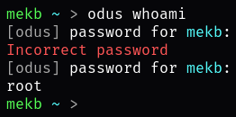

# odus
A sudo alternative for Linux

This project has three programs

- odus, a sudo alternative
- askpass, a tool that asks the user for a password to be called by other programs or shell scripts
- ggetty, an agetty alternative, starts a user login prompt on a tty

Basic configuration is done in [config.h](config.h)

TODO:

- [ ] pwfeedback, show asterisks instead of blank text when typing the password [odus, askpass, ggetty]
- [ ] have a cooldown on asking for the password, so it isn't annoying, but could reduce security [odus]
